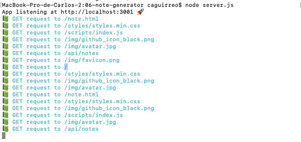
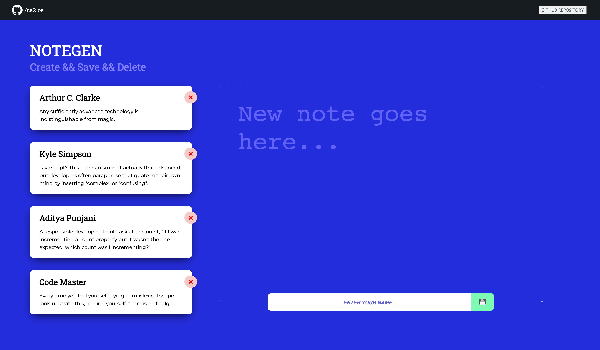

# NOTEGEN
###### Developed by [*ca2los*](https://github.com/ca2los)
HEROKU SERVER: [*TRY IT HERE*](https://afternoon-citadel-34271.herokuapp.com/)
VERSION 1.0

### *Note Generator*
In this project you have the option of read, create and delete notes in the browser. It's based on 3
HTTP methods: GET, POST, and READ. These three concepts allows the user to create notes by adding a usearname and the note description, save notes, store them as JSON format, and delete data. On browser's refresh, the data persistance will not delete the saved notes.

### Installation
To run *NoteGen*, you must make sure **Node JS** and **NPM** are already
installed in your computer.

#### *Node JS*
To check if **Node JS** is already installed, from your `Terminal Console` enter the
command `node -v` and press the **ENTER** key. It will show you a message with the
version of Node only if the package was installed before. If the message is different,
[click the link](https://nodejs.org/en/) and download the recommended version of the
package and install it.

#### *NPM*
To check if **NPM** is already installed, from your `Terminal Console` enter the
command `npm -v` and press the **ENTER** key. It will show you a message with the
version of Node only if the package was installed before. If the message is different,
then enter the command `npm install`and press the **ENTER** key.

### How to use it
From your terminal console, go through your files and locate the folder you want
to work with. Now enter the command `npm init -y` and press the **ENTER** key. Now
do the same with the command `npm i inquirer --save` and press the **ENTER** key.

Once the packages are installed, from your terminal console and in the same folder
run the command `node index.js`and press ENTER. Finally, when the program starts you
will need to access the requested data and press ENTER every time you finish.

```text
    // Command to initialize the program
    $ node server.js
    
    // The PORT is activated and ready to use
    ? App listening at http://localhost:3001 🚀
```

#### *WHAT IT DOES?*
1. The `npm init -y` creates a new JSON file loading the main settings of NPM libraries.


### SYNTAX

KEY | VALUE
------------ | -------------
`node server.js` | App listening to you local
`GET request to` | Access to available files and paths
`POST request to` | Publish data
`DELETE request to` | Eliminate data when the ID key is accessed

#### This is how you will see the program running from your CLI:


#### This is how you will see the program running on the browser:


#### The URLS to access JSON data from the browser
###### URL for JSON data: [*NOTES*](http://localhost:3001/api/notes)
###### URL for JSON data: [*VALIDATION*](http://localhost:3001/api/validation)

### Libraries
**[*EXPRESS LINK*](http://expressjs.com/en/5x/api.html#express)** Express library to develop
instructions for HTTP methods.

**[*FS LIBRARY LINK*](https://nodejs.org/en/knowledge/file-system/how-to-write-files-in-nodejs/)** Helpful to read, write and append a file from the Terminal.

**[*PATH LIBRARY LINK*](https://nodejs.org/api/path.html#path_path_resolve_paths)** Helpful to create and link file paths.

### Contributions
Let me know if you are interested in upgrading the base code of the program. [Contact
me via GitHub](https://github.com/ca2los), and commit your changes by following the instructions:

#### Test your code with JEST
Before pushing your changes, you must share a screenshot of the test generated by JEST. To begin with this process:

1. You must run at you terminal the command `npm install --save-dev jest`.
2. When the installation has finished, take a look at your `package.json` file and make sure the instruction `"test": "jest"` is inside `scripts`. If not, copy the code and paste it.
3. Now run the command ´npm run test´ and if the program shows you no errors, take a screenshot and add it in your push to make sure the code is OK.


### Testing
The code is still upgrading. The DELETE HTTP request is on development and further updates on selected data will be shared.

### MIT License
###### Developed by [*ca2los*](https://github.com/ca2los)